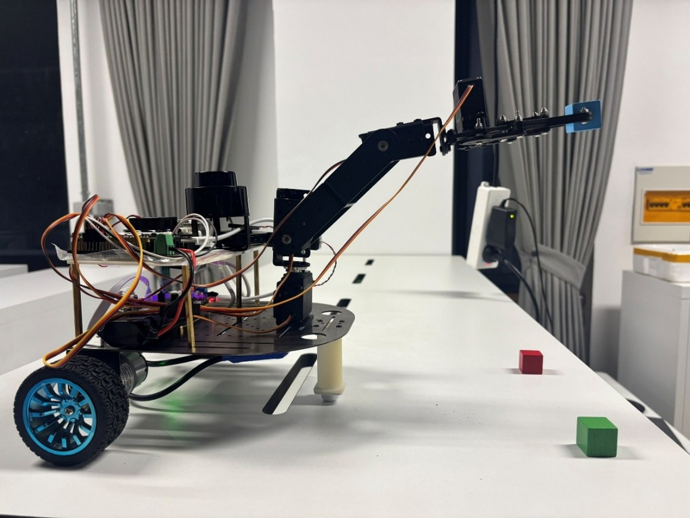
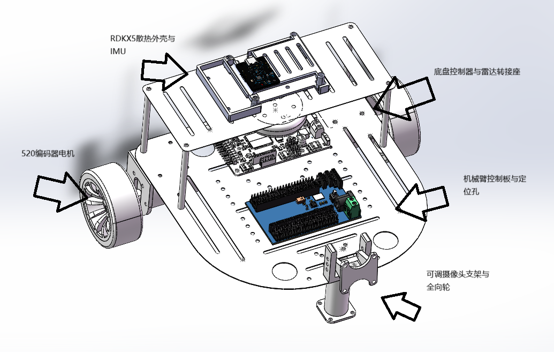
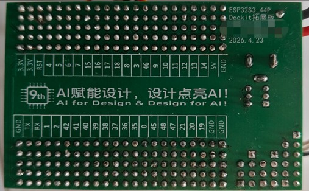
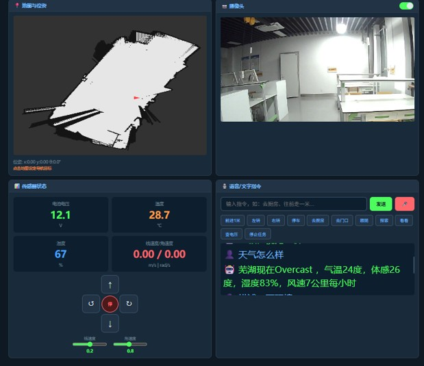
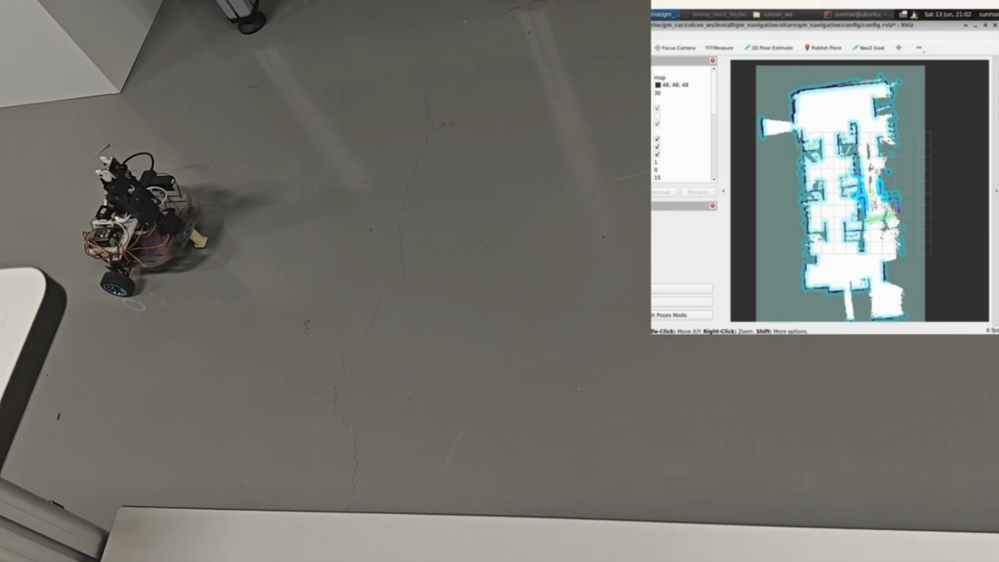

# gm_car —— 基于RDKX5的家庭服务机器人

## 项目简介

本项目是一台基于 **ROS2** 的智能机器人小车，集成了自主导航、机械臂控制、语音交互、大模型视觉推理等功能。系统采用 **RDKX5** 作为主控运行 ROS2 Humble，**ESP32S3** 负责舵机/电机底层驱动，**STM32F407VET6** 负责传感器采集与运动学解算。

### 软件架构总览

```
┌─────────────────────────────────────────────┐
│                  RDKX5 (ROS2)               │
│  ┌──────────┐ ┌──────────┐ ┌─────────────┐ │
│  │ gm_nav   │ │ gm_4dof  │ │ llm_vlm     │ │
│  │ 自主导航  │ │ 机械臂   │ │ 大模型推理   │ │
│  └──────────┘ └──────────┘ └─────────────┘ │
│  ┌──────────┐ ┌──────────┐ ┌─────────────┐ │
│  │ usb_cam  │ │ LSLIDAR  │ │ serial2ros2 │ │
│  │ 摄像头   │ │ 激光雷达  │ │ 串口桥接    │ │
│  └──────────┘ └──────────┘ └─────────────┘ │
│  ┌──────────┐ ┌──────────┐ ┌─────────────┐ │
│  │ tts_asr  │ │ follow   │ │ gm_dashboard│ │
│  │ 语音交互  │ │ 人员跟随  │ │ Web仪表盘   │ │
│  └──────────┘ └──────────┘ └─────────────┘ │
└──────────────┬──────────────┬───────────────┘
               │ Serial/USB   │ Serial/micro-ROS
    ┌──────────▼──────┐ ┌─────▼────────────────┐
    │   STM32F407     │ │     ESP32S3          │
    │ 传感器采集       │ │   舵机/电机驱动       │
    │ 运动学解算       │ │   底盘控制           │
    │ IMU/AHT30/蜂鸣  │ │   6DOF机械臂控制     │
    └─────────────────┘ └─────────────────────┘
```

## 硬件清单

| 序号 | 名称 | 说明 |
|------|------|------|
| 1 | RDKX5 | ROS2 主控板 |
| 2 | ESP32S3 + 舵机驱动板 | 可自购，也可用本项目开源的简易拓展板（[立创开源](https://oshwhub.com/eda_lkxnjdyfj/works)） |
| 3 | STM32F407VET6 拓展板| 可用幻尔拓展板直接烧录，也可参考项目代码独立设计外设 |
| 4 | 镭神激光雷达 | 如使用其他型号需自行修改驱动 |
| 5 | IMU（非必须） | 惯性测量单元 |
| 6 | AHT30 温湿度模块（非必须） | 环境传感 |
| 7 | 普通单目相机 | USB 摄像头即可 |
| 8 | 4~6 轴机械臂 | 项目中已适配 6 轴驱动 |
| 9 | 3D 打印件与钣金件 | 参考项目模型在嘉立创打印 |
| 10 | 电机 +轮胎+全向轮 | 推荐扭矩8kg/cm 默认轮子半径75cm 可自行修改参数 全向轮使用滚珠便可|
| 11 | HC-08蓝牙模块(非必须) | 若有便可独立控制底盘 |
## 目录结构

```
code/
├── my_robot/                        # ESP32S3 固件（PlatformIO 工程）
│   ├── platformio.ini               # PlatformIO 配置（含 micro-ROS）
│   ├── main_6DOF_backup.cpp         # 6轴机械臂 Web 控制（备份）
│   ├── src/
│   │   └── main.cpp                 # 主程序入口
│   ├── include/                     # 头文件
│   └── lib/                         # 第三方库
│
├── gm_car/                          # ROS2 工作空间
│   └── colcon_ws/src/
│       ├── gm_robot_bringup/        # 启动文件（遥控/建图/SLAM）
│       ├── gm_robot_1_description/  # 机器人 URDF 模型
│       ├── gm_navigation/           # 自主导航
│       ├── gm_exploration/          # 自主探索
│       ├── gm_4dof/                 # 机械臂控制
│       ├── gm_4dof_interfaces/      # 机械臂 ROS2 接口定义
│       ├── gm_car_interfaces/       # 通用 ROS2 接口定义
│       ├── gm_web_dashboard/        # Web 仪表盘
│       ├── serial2ros2/             # 串口 → ROS2 桥接
│       ├── LSLIDAR_X_ROS2/          # 镭神激光雷达驱动
│       ├── imu_ros2_device/         # IMU 驱动
│       ├── usb_cam/                 # USB 摄像头驱动
│       ├── follow_person/           # 人员跟随
│       ├── patrol_robot/            # 巡逻功能
│       ├── llm_vlm_brain_node/      # 大模型/视觉语言模型推理
│       ├── llm_vlm_brain_interfaces/# 大模型接口定义
│       ├── tts_asr_node/            # 语音合成/识别
│       ├── tts_asr_interfaces/      # 语音接口定义
│       ├── micro_ros_msgs/          # micro-ROS 消息定义
│       ├── micro-ROS-Agent/         # micro-ROS 代理
│       └── wp_map_tools/            # 航点地图工具
│
├── gm_car_2diff/                    # STM32F407 固件（Keil5 工程）
│   ├── Core/
│   │   ├── Inc/                     # 头文件
│   │   └── Src/                     # 源文件
│   ├── Drivers/                     # HAL 库驱动
│   ├── MDK-ARM/                     # Keil 工程文件
│   │   └── lhl_car.uvprojx         # Keil 工程入口
│   ├── gmcode/                      # 业务逻辑代码
│   │   ├── kinematic.c/h           # 运动学解算
│   │   ├── motor.c/h               # 电机控制
│   │   ├── msg.c/h                 # 消息处理
│   │   ├── myserial.c/h            # 串口通信
│   │   ├── QMI8658.c/h             # QMI8658 IMU 驱动
│   │   ├── adc_dma.c/h             # ADC/DMA 采集
│   │   ├── buzzer.c/h / led.c/h / key.c/h  # 外设驱动
│   │   └── extre.c/h               # 外部中断
│   └── lhl_car.ioc                 # STM32CubeMX 配置
│
└── README.md
```

## 使用流程

### 第一步：硬件准备

1. 按照硬件清单备齐所有组件
2. 组装 3D 打印件和钣金件外壳
3. 安装电机、舵机、机械臂到车体
4. 连接各传感器到对应主控板

### 第二步：烧录 STM32 固件

1. 安装 **Keil5** (MDK-ARM)
2. 打开 `gm_car_2diff/MDK-ARM/lhl_car.uvprojx`
3. 编译工程，通过 ST-Link / J-Link 烧录到 STM32F407VET6
4. STM32 负责：传感器采集（IMU/温湿度）、电机控制、运动学解算、串口通信

### 第三步：烧录 ESP32S3 固件

1. 安装 **VSCode** + **PlatformIO** 插件
2. 用 VSCode 打开 `my_robot/` 文件夹
3. PlatformIO 会自动识别 `platformio.ini` 配置，包含 micro-ROS 依赖
4. 编译后通过 USB 烧录到 ESP32S3
5. ESP32S3 负责：舵机 PWM 驱动、底盘电机控制、6 轴机械臂 Web 控制、与 RDKX5 的串口/micro-ROS 通信
6. 上电后 ESP32S3 自动连接 WiFi 热点，手机浏览器访问串口打印的 IP 即可控制机械臂

### 第四步：配置 RDKX5（ROS2 主控）

1. 确保 RDKX5 已安装 **ROS2 Humble**
2. 将 `gm_car/colcon_ws/` 拷贝到 RDKX5
3. 安装依赖并编译：

```bash
cd ~/colcon_ws
rosdep install --from-paths src --ignore-src -r -y
colcon build --symlink-install
source install/setup.bash
```

### 第五步：启动机器人

根据需求选择不同的启动模式：

```bash
# 纯遥控模式（无雷达建图）
ros2 launch gm_robot_bringup bringup_car_raw.py

# SLAM 建图模式（slam_toolbox）
ros2 launch gm_robot_bringup bringup_slamtool.py

# Cartographer 建图模式
ros2 launch gm_robot_bringup bringup_cartographer.py

# 导航模式（需已有地图）
ros2 launch gm_navigation gm_navigation.launch.py
```

### 第六步：可选功能启动

```bash
# Web 仪表盘（远程监控控制）
ros2 launch gm_web_dashboard gm_web_dashboard.launch.py

# 大模型视觉推理
ros2 run llm_vlm_brain_node llm_vlm_brain_node

# 语音交互（TTS/ASR）
ros2 launch tts_asr_node tts_asr.launch.py

# 人员跟随
ros2 run follow_person follow_person_node

# 机械臂控制
ros2 launch gm_4dof gm_4dof.launch.py
```

## 系统通信架构

```
[传感器层]          [控制层]            [决策层]
 激光雷达 ──UDP──►  LSLIDAR驱动 ──►
 USB相机 ──V4L2─►  usb_cam     ──►  gm_navigation
 IMU    ──I2C──►  STM32 ─串口─►  serial2ros2 ──►  gm_exploration
 电机   ──PWM──►  ESP32 ─串口─►  micro-ROS   ──►  llm_vlm_brain
 舵机   ──PWM──►  ESP32                       ──►  gm_4dof
 机械臂 ──PWM──►  ESP32 (6DOF)                ──►  follow_person
```

## 实物展示




## 软件截图

